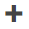

# Anwendungs-/ Benutzungshinweise

* TOC
{:toc}

## Wie logge ich mich ein?

1. Öffnen Sie [https://server.bimeta.de](https://server.bimeta.de/).
2. Gehen Sie auf Anmelden.
4. Geben Sie im Reiter **Log in** Ihre E-Mail-Adresse und Ihr Passwort ein.
5. Bestätigen Sie mit **LOG IN**

 
Mit Google einloggen:

 
Mit Microsoft Account einloggen:

 

## Wie setze ich mein Kennwort zurück?

1. Öffnen Sie [https://server.bimeta.de](https://server.bimeta.de/).
2. Gehen Sie auf Anmelden.
3. Klicken Sie auf **Don't remember your password?**
4. Geben Sie Ihre E-Mail-Adresse ein und bestätigen Sie mit **SEND EMAIL**
5. Sie erhalten eine E-Mail mit den weiteren Schritten.

 

## Wie bekomme ich einen Account?

1. Öffnen Sie [https://server.bimeta.de](https://server.bimeta.de/).
2. Gehen Sie auf Anmelden.
3. Welchseln Sie in den Reiter **Sign up**.
4. Geben Sie folgende Daten ein:
   - Ihre E-Mail-Adresse
   - Ihr gewünschtes Passwort, welches folgende Bedingungen erfüllen muss:
     - min. 8 Zeichen
     - min. 3 der 4 folgenden Zeichentypen:
       - Kleinbuchstabe (a-z)
       - Großbuchstabe (A-Z)
       - Zahl (0-9)
       - Sonderzeichen (!@#$%^&*)
   - Ihren Vornamen
   - Ihren Nachnamen
   - Ihre Firma
5. Bestätigen Sie Ihre Eingabe mit **SIGN UP**

 
Mit Google anmelden:

 
Mit Microsoft Account anmelden:

 

## Wie erfasse ich ein Merkmal?
1. Wählen Sie zuerst den Herausgeber, die Domäne und das Klassifikationssystem.
2. Fügen Sie mittels  (Über den vorhandenen Merkmalen) ein neues Merkmal hinzu.
3. Öffnen Sie über  **neues Merkmal**, welches in der Merkmalsliste hinzugefügt wurde.
4. Füllen Sie die gewünschten Felder aus. Eine Erklärung aller Felder finden Sie [hier]().
5. Mit  rechts über dem Merkmalsfenster bestätigen.
 
  
[Beispiel Erfassen eines Merkmals](https://www.iorad.com/player/1815762/Erfassen-eines-Merkmals)

 

## Wie erfasse ich eine Klasse?
1. Wählen Sie zuerst den Herausgeber, die Domäne und das Klassifikationssystem.
2. Fügen Sie mittels  (Über den vorhandenen Klassen) eine neue Klasse hinzu.
3. Wählen Sie **neue Klasse**, welche im Klassenbaum hinzugefügt wurde.
4. Füllen Sie die gewünschten Felder aus. Eine Erklärung aller Felder finden Sie [hier]().
5. Mit  rechts über dem Klassenfenster bestätigen.
6. Die neue Klasse erscheint im Klassifikationssystembaum und kann ggf. geändert werden.
7. Nun können Merkmale hinzugefügt werden oder Subklassen erstellt werden.
   - Merkmale hinzufügen [Link zu diesen Hinweis]
   - [Subklasse erstellen](#wie-erfasse-ich-eine-subklasse)
   
 

## Wie erfasse ich eine Subklasse?
1. Wählen Sie Ihre Übergeordnete Klasse aus.
2. Rechts neben der Klasse erscheint ein Plus, über welches Sie durch einen Klick die Subklasse hinzufügen können. 

3. Füllen Sie die gewünschten Felder aus. Eine Erklärung aller Felder finden Sie [hier]().
   Sie können unter Info die Übergeordnete Klasse finden.
4. Mit  rechts über dem Klassenfenster bestätigen.
5. Im Klassenbaum können Sie nun die übergeordnete Klasse aufklappen und sehen die Subklasse.

## Was bedeuten die einzelnen Eingabefelder?
### Klassenerstellung
#### Reiter Info
Feld|Bedeutung
----|---------
Identifikator der Klasse|
Guid (RFC4122)|
Guid (IFC Kurzformat)|
Klassifikationssystem|
Übergeordnete Klasse|  

#### Reiter DE und EN
Durch die Eingaben in den Reitern DE und EN wird automatisch eine Übersetzung mit abgespeichert und es muss keine weitere Klasse eingefügt werden.

Feld|Bedeutung
----|---------
Klassenname|
Definition der Klasse|
Bemerkung|
Beispiele|
Synonyme|

#### Reiter Workflow
Feld|Bedeutung
----|---------
Status|
Veröffentlicht mit Version|
Unveröffentlicht mit Version|
Letzte Änderung|

Status Möglichkeiten:
- Abgekündigt
- Änderung angefragt
- Angefragt
- Erfasst
- Freigabe Katalogausschuss beantragt
- Geprüft
- Nicht übersetzt
- Obsolet
- Publiziert
- Übersetzt
- Übersetzung geprüft

#### Reiter Änderungsprotokoll
In diesem Reiter wird das Änderungsprotokoll angezeigt.
Dort finden Sie den Typ, das Aktualisierungsdatum, den Feldnamen, den alten Wert, den neuen Wert und den Benutzername, welcher die Änderungen durchgeführt hat.

#### Reiter Mappings

#### Reiter Merkmale

### Merkmalserstellung

   
