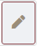

* TOC
{:toc}

# Anleitungen in der Klassenverwaltung und -ansicht
Auf der Seite werden die Anleitungen in der Klassenverwaltung und -ansicht von BIMeta vorgestellt.  
Die Benutzeroberfläche des Klassenverwaltung wird [hier](2.3.1_UIKlasse.md) erklärt.

## Wie wähle ich eine Klasse aus?
Um das gewünschte Klassifikationssystem verwalten oder einsehen zu können, müssen Sie zuerst einen Herausgeber, eine Domäne und ein Klassifikationssystem wählen.
Voraussetzung dafür sind vorhandene [Benutzerrechte](2.1_Anmeldung.md#wie-sehe-ich-meine-benutzerrechte-ein).

Wählen Sie einen Herausgeber.  
Wählen Sie eine Domäne.  
Wählen Sie ein Klassifikationssystem. 

Im Anschluss wird Ihnen das gewünschte Klassifikationssystem präsentiert.

## Wie erstelle ich eine Klasse?
1. Wählen Sie zuerst den Herausgeber, die Domäne und das Klassifikationssystem.
3. Fügen Sie mittels  (Über dem Klassenbaum) eine neue Klasse hinzu.
4. Geben Sie die gewünschten Informationen in den Klassenbereich ein. Eine Erklärung aller Felder finden Sie [hier](3.2.1_FelderKlasse.md).
5. Mit  rechts über dem Klassenbereich bestätigen.
6. Die neue Klasse erscheint im Klassifikationssystembaum und kann ggf. geändert werden.
7. Nun können [Merkmale hinzugefügt](#wie-weise-ich-ein-merkmal-einer-klasse-zu) werden oder [Subklassen erstellt](#wie-erstelle-ich-eine-subklasse) werden.

Sollte sich nach dem 2. Schritt der Klassenbaum neu geladen haben, weil Sie z.B. auf eine andere Klasse geklickt haben, wird die neue Klasse im Klassenbaum als "neue Klasse" angezeigt und kann bearbeitet werden.

### Wie erstelle ich eine Subklasse?
1. Wählen Sie die übergeordnete Klasse aus.
2. Rechts neben der Klasse erscheint , über welches Sie die Subklasse durch einen Klick hinzufügen können. 
3. Geben Sie die gewünschten Informationen in den Klassenbereich ein. Eine Erklärung aller Felder finden Sie [hier](3.2.1_FelderKlasse.md).   Sie können im Reiter Info die Übergeordnete Klasse finden.
4. Mit  rechts über dem Klassenbereich bestätigen.
5. Im Klassenbaum können Sie nun die übergeordnete Klasse aufklappen und die Subklasse sehen.
    
    
## Wie weise ich ein Merkmal einer Klasse zu?
1. Wählen Sie zuerst den Herausgeber, die Domäne und das Klassifikationssystem.
2. Wählen Sie die Klasse, welcher Sie ein Merkmal zuweisen möchten.
3. Wechseln Sie im Klassenbereich auf den Reiter "Merkmale".
4. Klicken Sie auf  in dem Reiter "Merkmale".
5. Wählen Sie das gewünschte Merkmal aus dem sich öffnenden Fenster.
6. Bestätigen Sie dieses mit 
7. Schließen Sie das Auswahlfenster.
8. Das Merkmal wird nun im Reiter "Merkmale" angezeigt.

## Wie weise ich ein vererbbares Merkmal zu?
1. Weisen Sie einer Klasse ein Merkmal zu.
2. Das Merkmal wird nun im Reiter "Merkmale" angezeigt.
3. Öffnen Sie das Merkmal in diesem Reiter über .
4. Aktivieren Sie das Feld "Vererbt".
5. Bestätigen Sie Ihre Eingabe rechts über dem Klassenbereich mit . 
6. Das Merkmal wird nun an alle Subklassen vererbt.

## Wie ändere ich eine Klasse?
1. Wählen Sie zuerst den Herausgeber, die Domäne und das Klassifikationssystem.
2. Wählen Sie die zu ändernde Klasse.
3.  Mit  rechts über den Klassenbereich aktivieren Sie den Bearbeitungsmodus.
4.  Bearbeiten Sie die Klasse.
5.  Bestätigen Sie die Änderungen mit  rechts über dem Klassenbereich.

 

[ZURÜCK](2.2.0_Anleitungen.md)

[Zurück zur Startseite](https://bimeta-steuerkreis.github.io/Anwenderhilfe/)
