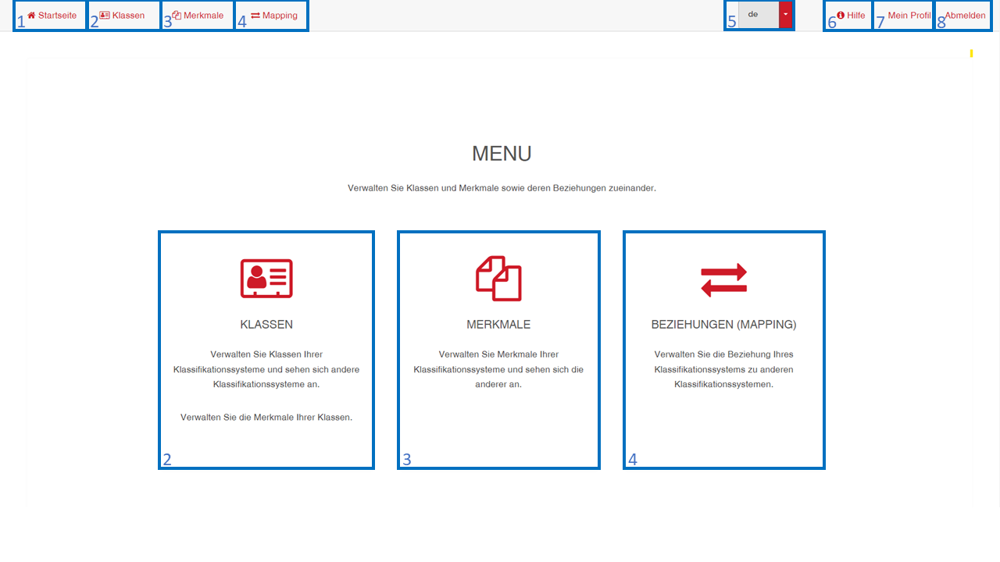

# Benutzeroberfläche
Im folgenden werden die Benutzeroberflächen erläutert.

[Benutzeroberfläche Klasse](2.3.1_UIKlasse.md)

[Benutzeroberfläche Merkmal](2.3.2_UIMerkmal.md)

[Benutzeroberfläche Mapping](2.3.3_UIMapping.md)

 

## Startseite

1 - Aufrufen der Startseite 
2 - Aufrufen der Klassenverwaltung und -ansicht 
3 - Aufrufen der Merksmalsverwaltung und -ansicht 
4 - Aufrufen der Beziehungsverwaltung 
5 - Auswahl der Sprache 
6 - Aufrufen der Hilfe 
7 - Einsicht in das Benutzerprofil 
8 - Abmelden 

 

[ZURÜCK](2.0_Anwendungshinweise.md)

[Zurück zur Startseite](https://bimeta-steuerkreis.github.io/Anwenderhilfe/)
