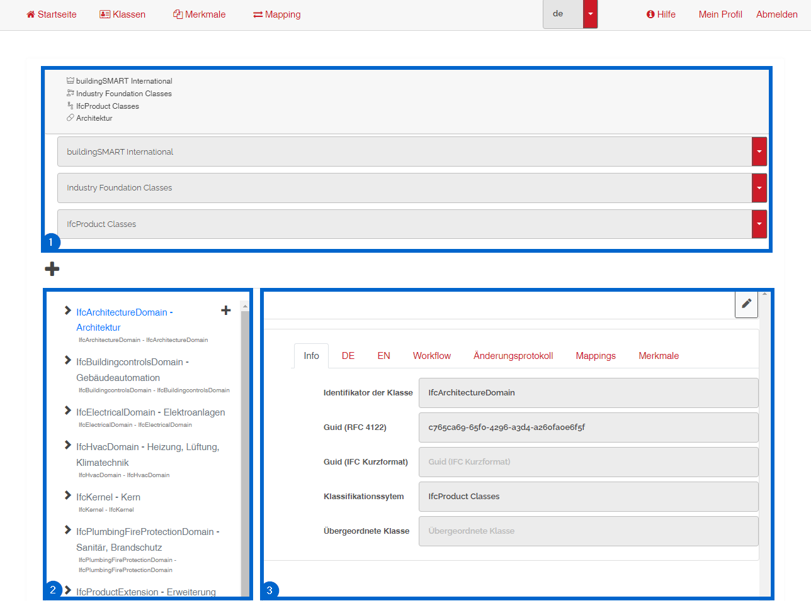
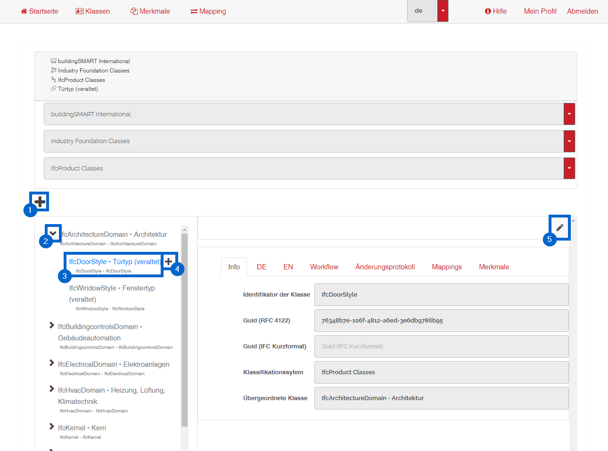

# Benutzeroberfläche der Klassenverwaltung und -ansicht

## Übersicht

1 - Auswahl des Herausgebers, der Domäne und des Klassifikationssystems  
2 - Klassenbaum  
3 - Klassenbereich mit den Informationen zur ausgewählten Klasse  

 

## Klasse verwalten

1 - Klasse hinzufügen 
2 - Klasse aufklappen 
3 - ausgewählte Klasse 
4 - Subklasse hinzufügen 
5 - Klassendetails bearbeiten oder speichern 

 

[ZURÜCK](2.3.0_UI.md)

[Zurück zur Startseite](https://bimeta-steuerkreis.github.io/Anwenderhilfe/)
