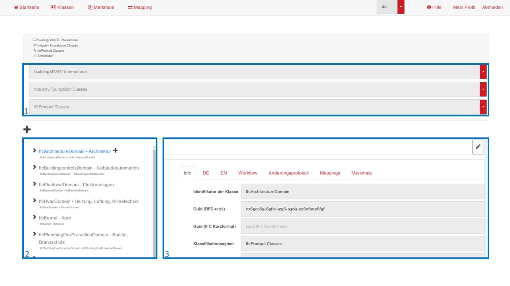

# Benutzeroberfläche einer Klasse

1 - Auswahl des Herausgebers, der Domäne und des Klassifikationssystems  
2 - Klassenbaum  
3 - Klassenbereich mit den Informationen zur ausgewählten Klasse  

[ZURÜCK](2.3.0_UI.md)

[Zurück zur Startseite](https://bimeta-steuerkreis.github.io/Anwenderhilfe/)
