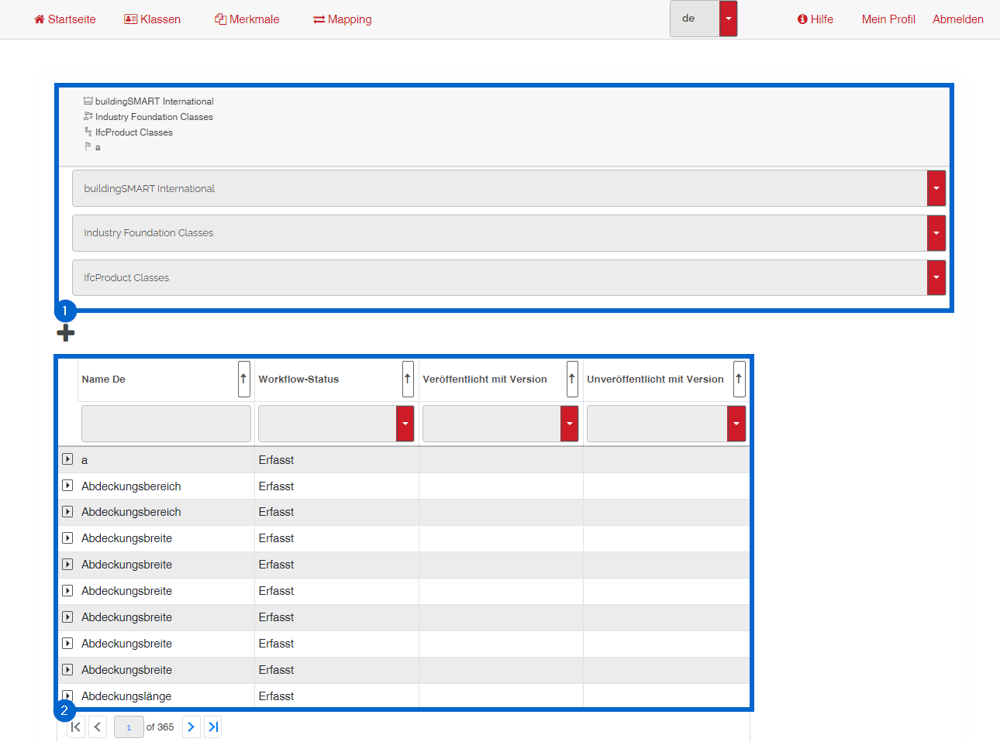
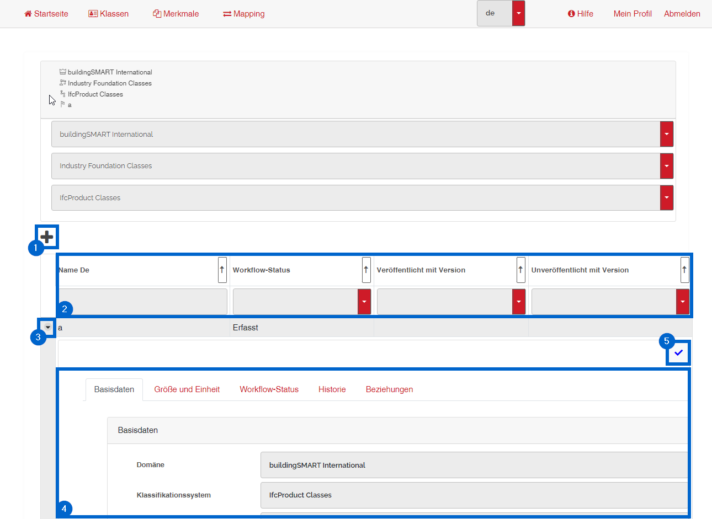

# Benutzeroberfläche der Merkmalsverwaltung und -ansicht
## Übersicht

1 - gewählter Herausgeber, Domäne und Klassifikationssystem  
2 - Merkmale  

## Merkmal verwalten

1 - Neues Merkmals hinzufügen  
2 - Filterbereich  
3 - Merkmal aufklappen  
4 - Merkmalsbereich  
5 - Merkmalsdetails bearbeiten oder speichern  

 

[ZURÜCK](2.3.0_UI.md)

[Zurück zur Startseite](https://bimeta-steuerkreis.github.io/Anwenderhilfe/)
