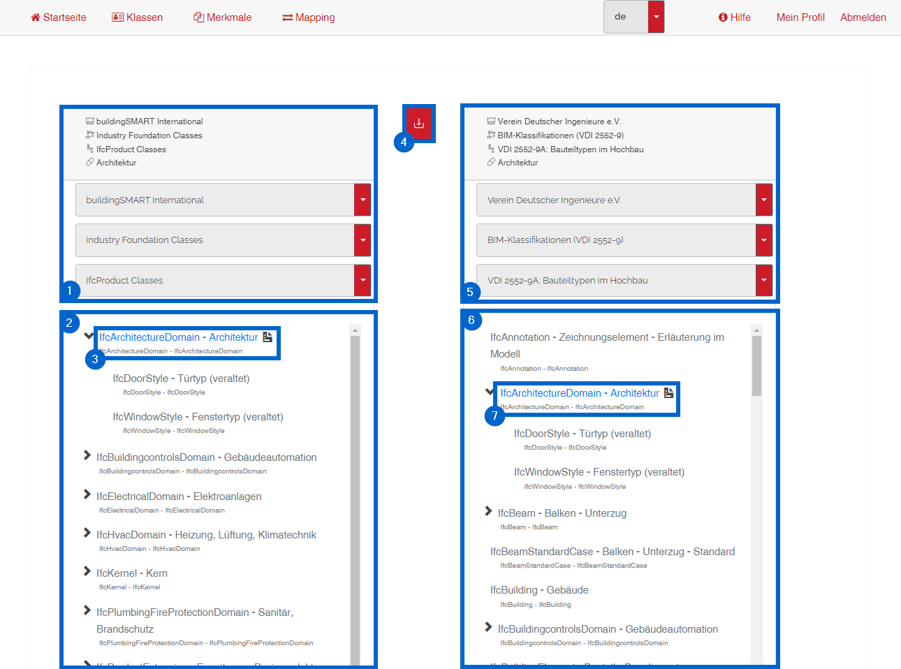
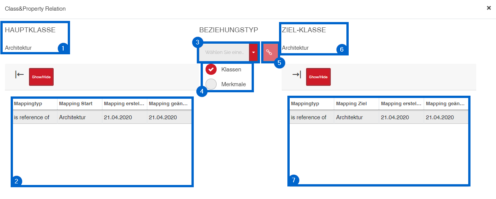

# Benutzeroberfläche des Mappings

## Übersicht

1 - Auswahl des Herausgebers, der Domäne und des Klassifikationssystems des Mapping-Starts   
2 - Klassenbaum des Mapping-Starts  
3 - Gewählte Mapping-Start-Klasse  
4 - Verbinde Klasse und Merkmale  
5 - Auswahl des Herausgebers, der Domäne und des Klassifikationssystems des Mapping-Ziels  
6 - Klassenbaum des Mapping-Ziels  
7 - Gewählte Mapping-Ziel-Klasse 

## Mapping erstellen

1 - Gewählte Mapping-Start-Klasse  
2 - Vorhandenes Mapping der Mapping-Start-Klasse 
3 - Auswahl des Beziehungstypen 
4 - Auswahl des Mapping zwischen Klassen oder Merkmalen 
5 - Erstellung der Verbindung 
6 - Gewählte Mapping-Ziel-Klasse  
7 - Vorhandenes Mapping der Mapping-Ziel-Klasse 

 

[ZURÜCK](2.3.0_UI.md)

[Zurück zur Startseite](https://bimeta-steuerkreis.github.io/Anwenderhilfe/)
